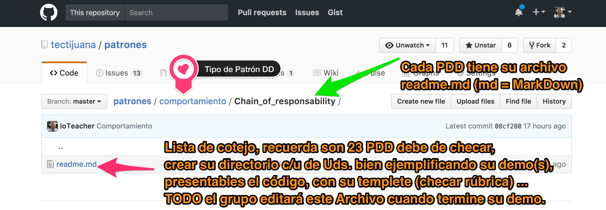

    /* 
    Title: Practica 1 - Hola Mundo en Swift			Filename: practica1-HolaMundo.swift
    Author: Chipres Castellanos Ana Maria 			Date: 3 - Feb - 2017
    Description: HOLA MUNDO en Swift
    Input: -
    Output: HOLA MUNDO
	
    */

----

